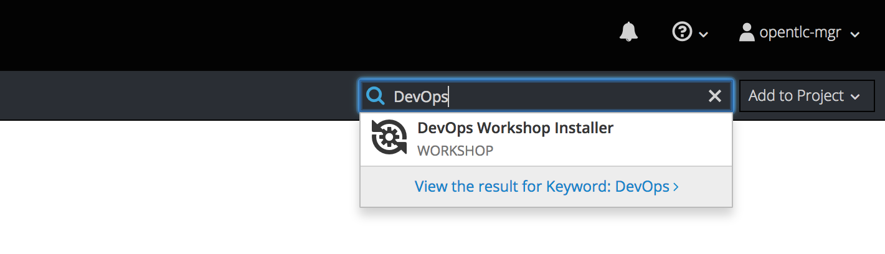
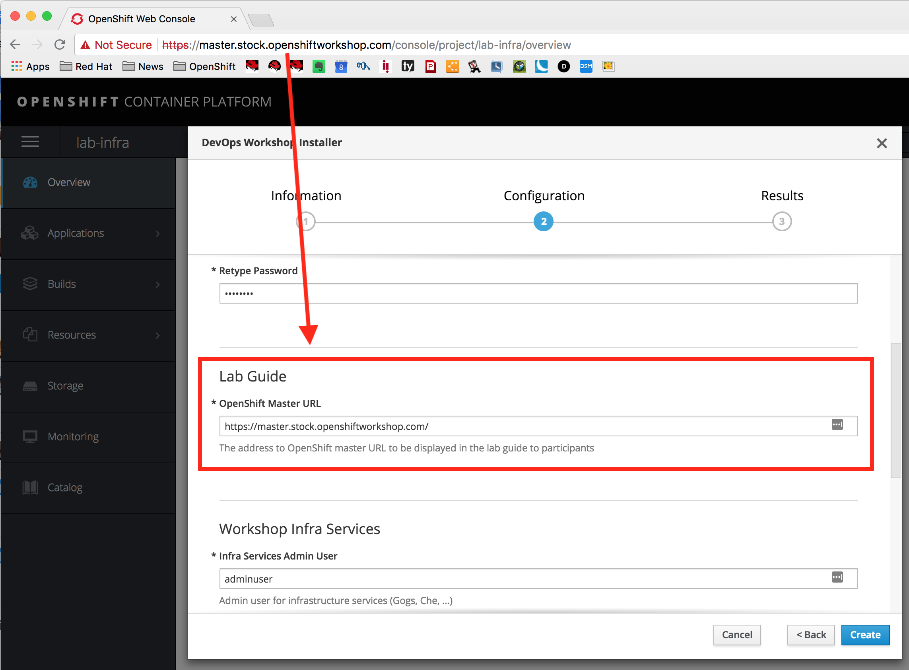
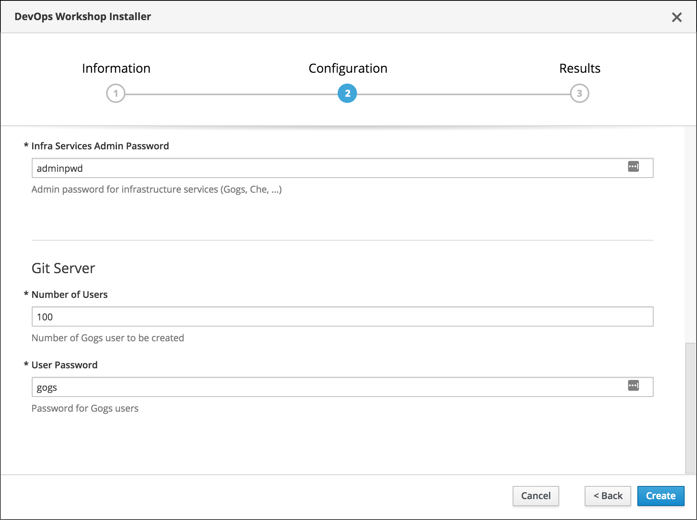

# Lab - DevOps Workshop on OpenShift [](https://travis-ci.org/openshift-labs/devops-guides)

* [Overview](#overview)
* [Deploying the Workshop](#deploying-the-workshop)
  * [Deploying on Red Hat Product Demo System](#deploying-on-red-hat-product-demo-system)
  * [Manual Workshop Installation](#manual-workshop-installation)
  * [Install Lab Guides Only](#install-the-lab-guides-only)
* [Running the Workshop](#running-the-workshop)
* [Development](#development)

## Overview

The DevOps with OpenShift Workshop provides full-stack and DevOps engineers an introduction to OpenShift and containers and how it can be used to build fully automated end-to-end deployment pipelines using advanced deployments techniques like rolling deploys and blue-green deployment.

This workshop is a half-day event with a series of hands-on labs that are designed to familiarize participants with DevOps and Continuous Delivery concepts. The workshop will walk them through building an automated pipeline and how to customize Jenkins in various ways.

The lab application used in this workshop is available at https://github.com/openshift-labs/devops-labs

### Agenda
* DevOps Introduction
* Explore OpenShift
* Deployment Environments
* Creating a Simple CI/CD Pipeline
* Pipeline Definition as Code
* Application Promotion Between Environments
* Running the CI/CD Pipeline on Every Change
* Zero-Downtime Deployment to Production
* Automated Zero-Downtime Deployment with CI/CD Pipelines
* Deploying Jenkins Manually
* Creating Custom Jenkins Slave Pods


| | |
--- | ---
| Audience Experience Level | Beginner |
| Supported Number of Users | Up to 100 |
| Average Time to Complete | 4 hours |

### Supplementary Content
* [Lab Guide Introductory Slides](https://docs.google.com/presentation/d/1W4POTNEDAXyqXwLB_VLhaG_L19aZ1JXwjpCQUkprvqM/edit)

## Deploying the Workshop

### Deploying on Red Hat Product Demo System
This workshop is typically run from RHPDS. Follow the instructions below to prepare the workshop on RHPDS.

* [Order an "OpenShift Workshop" cluster on RHPDS](https://mojo.redhat.com/docs/DOC-1175640), and after the workshop is ready, log in as the cluster admin. This will provide you with an OpenShift 3.10 or 3.11 cluster, depending on what you choose.
* Create a project with the name `lab-infra` (or any other name, that's just a suggestion) where the workshop infrastucture components such as Nexus, Gogs git server, lab guides, etc. will be deployed.
* In the OpenShift service catalog search for "devops" and then click on the **DevOps Workshop Installer** and then click on the **Next** button.


* Enter the requested info. Note that the cluster admin username and password are required again since Automation Broker on OpenShift does not run as cluster admin (to avoid destructive behavior of course!). Also, enter the OpenShift public URL so that it is displayed in the lab guide correctly.


* Enter the number of users you will have in the workshop so that Git repositories are created and pre-populated for them.


* Then click on the **Create** button.

The provisioning of the workshop will get started and it takes around 10 minutes. You will see pods popping up in the `lab-infra` project as the workshop is being provisioned.

### Manual Workshop Installation

Typically you will follow the instructions above to Deploy the workshop via RHPDS. If you want to manually deploy it, follow these instructions.

An [APB](https://hub.docker.com/r/openshiftapb/cloudnative-workshop-apb) is provided for 
deploying the DevOps Workshop infra (lab instructions, Nexus, Gogs, Eclipse Che, etc) in a project 
on an OpenShift cluster via the service catalog. In order to add this APB to the OpenShift service catalog, log in 
as cluster admin and perform the following in the `openshift-ansible-service-broker` project :

1. Edit the `broker-config` configmap and add this snippet right after `registry:`:

  ```
    - name: dh
      type: dockerhub
      org: openshiftapb
      tag: ocp-3.11
      white_list: [.*-apb$]
  ```

2. Redeploy the `asb` deployment

You can [read more in the docs](https://docs.openshift.com/container-platform/3.11/install_config/oab_broker_configuration.html#oab-config-registry-dockerhub) 
on how to configure the service catalog.

Note that if you are using the _OpenShift Workshop_ in RHPDS, this APB is already available in your service catalog.


As an alternative, you can also run the APB directly in a pod on OpenShift to install the workshop infra:

```
oc login
oc new-project lab-infra
oc run apb --restart=Never --image="openshiftapb/devops-workshop-apb:ocp-3.11" \
    -- provision -vvv -e namespace=$(oc project -q) -e openshift_token=$(oc whoami -t)

```

Or if you have Ansible installed locally, you can also run the Ansible playbooks directly on your machine:

```
oc login
oc new-project lab-infra

ansible-playbook -vvv playbooks/provision.yml \
       -e namespace=$(oc project -q) \
       -e openshift_token=$(oc whoami -t) \
       -e openshift_master_url=$(oc whoami --show-server)
```

## Install the Lab Guides Only

Note that if you have used the above workshop installer, the lab instructions are already deployed.

If you want to install only the lab guides, use the following command:

```
oc new-app osevg/workshopper:latest --name=guides \
    -e CONTENT_URL_PREFIX=https://raw.githubusercontent.com/openshift-labs/devops-guides/ocp-3.11 \
    -e WORKSHOPS_URLS=https://raw.githubusercontent.com/openshift-labs/devops-guides/ocp-3.11/_devops-workshop.yml
oc expose svc/guides
```
## Running the Workshop
After provisioning is complete, the following components are deployed in the `lab-infra` project which is used by the workshop participants during the labs: 

* **Nexus Maven Repository**: http://nexus-lab-infra.apps.YOURCITY-GUID.open.redhat.com
* **Eclipse Che Web IDE**: http://che-lab-infra.apps.YOURCITY-GUID.open.redhat.com
* **Gogs Git Server**: http://gogs-lab-infra.apps.YOURCITY-GUID.open.redhat.com
* **Lab Guides**: http://guides-lab-infra.apps.YOURCITY-GUID.open.redhat.com

Note that YOURCITY is replaced with what you entered as **City or Customer** when ordering the OpenShift Workshop cluster in RHPDS. The GUID is a 4 character value that's generated, and you'll find it in the RHPDS emails or in the name of your Service listing in RHPDS.

An example of the lab guides is available [here](http://devops-guides-labs.b9ad.pro-us-east-1.openshiftapps.com/).

## Development

If you're doing development on the lab content, clone or fork the git repository and run the following inside the working copy directory:

```
docker run -it --rm -p 8080:8080 \
              -v $(pwd):/app-data \
              -e LOG_TO_STDOUT=true \
              -e CONTENT_URL_PREFIX="file:///app-data" \
              -e WORKSHOPS_URLS="file:///app-data/_devops-workshop.yml" \
              quay.io/osevg/workshopper:latest
```
